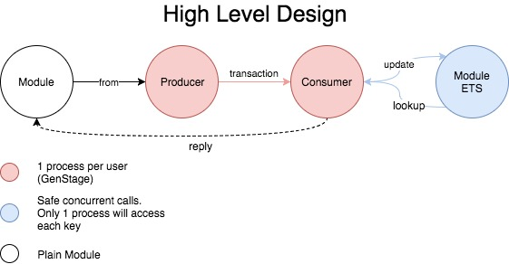
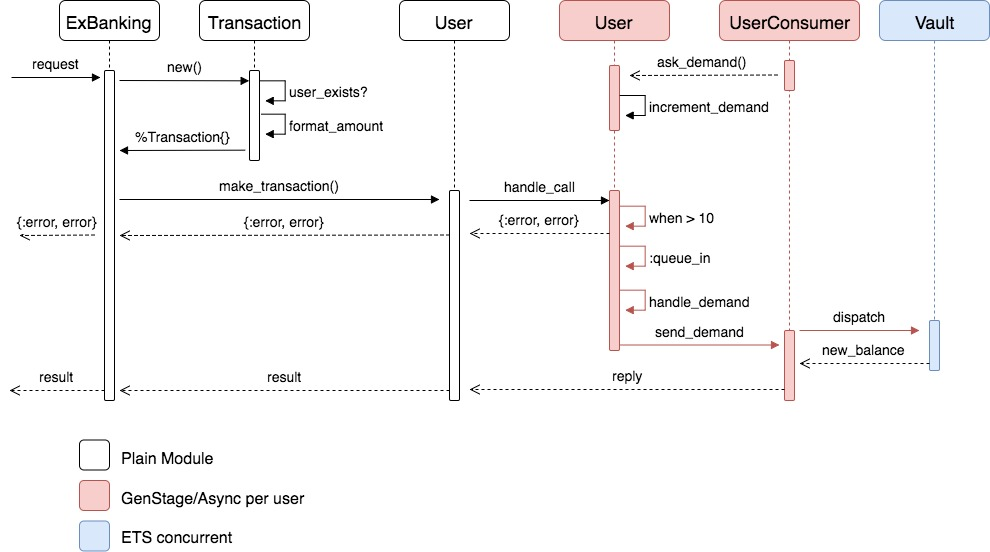

# ExBanking

ExBanking is a gateway to process transaction among users
independently one from another. You can see the 
specification and API at [Requirements.md](./requirements.md).

## Every user is a pair of `GenStage`

For every user created, there is a par of `GenStage` with a producer and a consumer. This lets every user to handle transactions independently. You can see more about this at `ExBanking.User` and `ExBanking.UserConsumer`.

## Transaction

Inside the system the concept of `ExBanking.Transaction` exists. This is how the system speaks internaly, validating constraints that does not depend of the state. For example: *Money amount of any currency should not be negative.*

## State stored in ETS

The information of the users is stored on a `ExBanking.User.Vault` `:ets` table. It is being protected from crashing by having an `heir` available at all times with the help of the `Element` library.

## Money

Money is handled as integers internally. Being formated on at input and output moments. See more on `ExBanking.Format`.

## Testing

You can run the tests with `mix test`

## High Level Design

## Sequence Diagram

Documentation can be generated with [ExDoc](https://github.com/elixir-lang/ex_doc)

